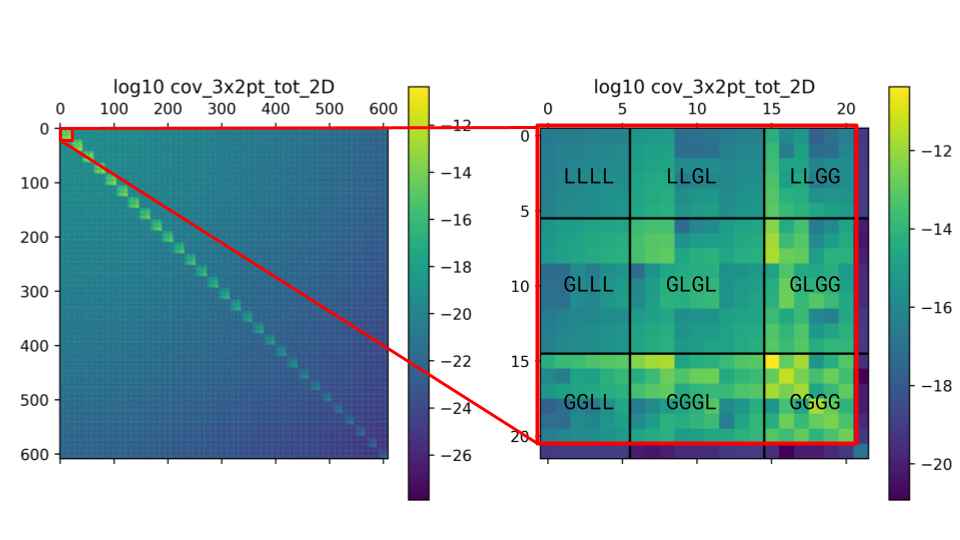
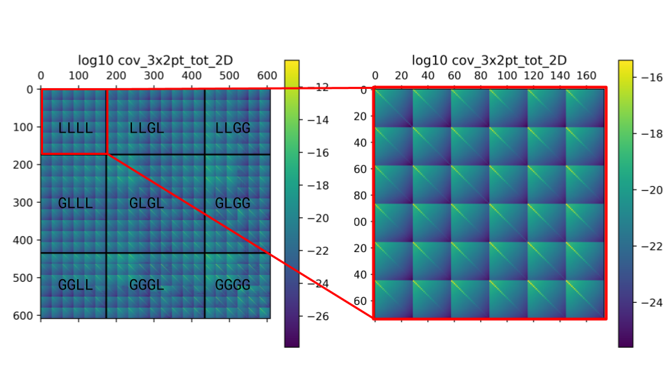
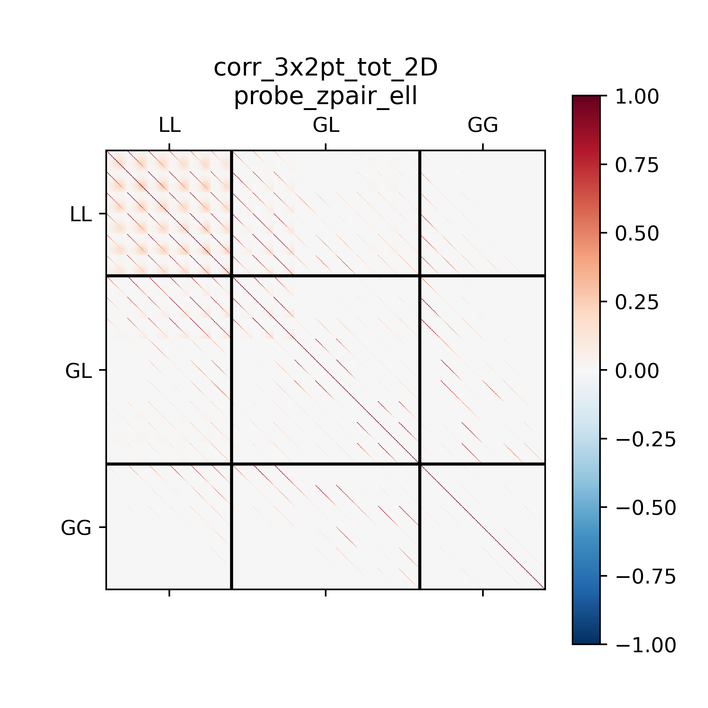
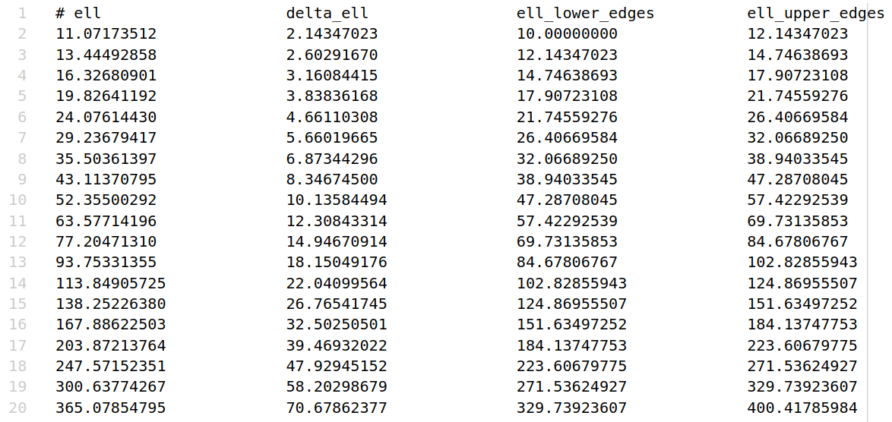

I/O
===

======
Inputs
======

The code requires several input files, depending on the settings chosen in the ``yaml``
configuration file.

1. **Intrinsic Alignment**. 

   In the eNLA model, the parameter :math:`\beta_{\rm IA}`
   regulates the redshift scaling of the luminosity ratio 
   :math:`\left[ \langle L \rangle(z) / L_{\star}(z) \right]`:
   
   .. math::

      P_{\delta {\rm IA}}(k, z)= - \frac{ \mathcal{A}_{\rm IA} C_{\rm IA} 
      \Omega_{\rm m,0} \mathcal{F}_{\rm IA}(z) }{ D(z) } P_{\delta \delta}(k, z)
      
   where the redshift evolution is given by

   .. math::

      \mathcal{F}_{\rm IA}(z) = \left( \frac{1+z}{1+z_{\rm pivot}} \right)^{\eta_{\rm IA}} 
      \left[ \langle L \rangle(z) / L_{\star}(z) \right]^{\beta_{\rm IA}}

   If :math:`\beta_{\rm IA}` is different from zero, 
   a file with the values of the luminosity ratio as a function of redshift should be
   provided. This file should have two columns, the first one containing the redshift 
   and the second one the luminosity ratio. Its location can be specified in the
   configuration file:

   .. code-block:: yaml

      intrinsic_alignment:
         bIA: 0.0        
         lumin_ratio_filename: null

2. :math:`\boldsymbol{C_{ij}(\ell)}`

   The input :math:`C_{ij}(\ell)` can be provided as an external input to 
   compute the Gaussian
   covariance. In this case, the input files should be provided in the following
   format:
   
   * first column: :math:`\ell` values
   * second column: index of the i-th redshift bin
   * third column: index of the j-th redshift bin
   * fourth column: :math:`C_{ij}(\ell)` value

   
   .. figure:: images/cls.png
      :align: center
   
   A couple words of caution in this case:

   * Even when input :math:`C_{ij}(\ell)` are used, the code will compute radial kernels 
     to project the non-Gaussian covariance trispectra. The user should make sure that the 
     input cls match the cosmology and systematics defined in the configuration file. 
     To facilitate this comparison, a plot comparing the input (auto-ij) 
     :math:`C_{ij}(\ell)` to the internally computed ones (either with ``CLOE`` 
     or ``CCL``) will be produced when running the code with the ``--show-plots`` flag.
   * The input :math:`C_{ij}(\ell)` will be interpolated with splines in the :math:`\ell` 
     values required in the cfg file; for this, the Cls should be sampled on a 
     sufficiently large number of :math:`\ell` points.

     .. code-block:: yaml

        C_ell:
           use_input_cls: True     

              cl_LL_path: ./input/cl_ll.txt # shear-shear 
              cl_GL_path: ./input/cl_gl.txt # galaxy-shear 
              cl_GG_path: ./input/cl_gg.txt # galaxy-galaxy 

3. **Galaxy and magnification bias**. 

   The values of :math:`b_g(z)` and  
   :math:`b_m(z) = 5s(z)-2`, with :math:`s(z)` the logarithmic slope of the lenses’ 
   luminosity function for the given selection. These 
   files should have ``zbins + 1`` columns, the first one containing the redshift and the 
   remaining ones the value of the bias in each redshift bin (these values can coincide). 
   The location of these files can be specified in the configuration file:

   .. code-block:: yaml

      C_ell:
         gal_bias_table_filename: ./input/gal_bias.txt
         mag_bias_table_filename: ./input/mag_bias.txt
    
   If these files are not provided, the code will use a third-order polynomial fit of 
   the form:

   .. math::
      
      b_X(z) = a_{X, 0} + a_{X, 1} \, z + a_{X, 2} \, z^2 + a_{X, 3} \, z^3

   where :math:`X` can be either ``g`` or ``m``. The coefficients :math:`a_{X, i}` can 
   be specified in the configuration file. 

   For the galaxy bias, we also provide the option to use the galaxy bias computed from 
   the HOD model through ``CCL``. In the last two cases (polynomial bias and HOD bias), 
   **the bias will be the same in all redshift bins.**, i.e. 
   :math:`b^i_{X}(z) = b^j_{X}(z)`.

4. **Mask**

   The mask can be provided in ``.fits`` or ``.npy`` format. Additionally, the code
   offert the possibility to generata a circular footprint covering the survey area 
   and with the ``nside`` specified in the configuration file. The mask can also be 
   apodized, in which case make sure you have ``NaMaster`` installed.

   .. code-block:: yaml

      mask:
         load_mask: False
         mask_path: ../input/mask.fits
         generate_polar_cap: True
         nside: 1024
         survey_area_deg2: 13245
         apodize: False
         aposize: 0.1

=======
Outputs
=======

++++++++++
Covariance
++++++++++

The main output of ``Spaceborne`` is the covariance matrix for the requested probes
and statistics. The path to the output folder can be specified in the 
configuration file; the file format is ``.npz``, for maximum storage
efficiency. These files can be loaded into ``numpy`` arrays with

.. code-block:: python

   cov = np.load('cov_out.npz')['arr_0']

In general, harmonic-space covariance matrix can be described by a 10-dimensional array 
with shape ``cov[A, B, C, D, ell1, ell2, zi, zj, zk, zl]``. In this representation: 

* The first four axes index the probes (:math:`A, B, C, D \in [L, G]`), 
  where *L* and *G* stand for 
  "lensing", "galaxy" (or equivalently "shear", "position") respectively.
* The fourth and fifth  axes index the multipoles :math:`\ell_1` and :math:`\ell_2`.
* The last four axes index the redshift bins :math:`z_i, z_j, z_k, z_l`.

The redshift indices can then be compressed leveraging the symmetry for the auto-spectra: 
:math:`C_{ij}^{AA}(\ell) = C_{ji}^{AA}(\ell)`. This simply means taking the 
upper or lower triangle of the :math:`C_{ij}(\ell)` matrix (for each :math:`\ell`), 
in a row-major or column-major fashion. 
This is the meaning of the ``triu_tril`` and ``row_col_major`` 
options in the configuration file. Compressing the covariance matrix in this way will
result in an eight-dimensional array with the shape 
``cov[A, B, C, D, ell1, ell2, zij, zkl]``, with ``zij`` and ``zkl`` indexing the unique 
redshift *pairs*. To create a 2D array, we can simply flatten by looping over the 
different indices; to do this, we need to choose the order of the loops, which will 
determine the structure of the 2D covariance matrix. This can be specified with the
``covariance_ordering_2D`` key in the configuration file. The possible options are:

* ``ell_probe_zpair``: the :math:`\ell` index will be the outermost one, followed by the
  probe and the redshift pair indices.
* ``probe_ell_zpair``: the probe index will be the outermost one, followed by the
  multipole and the redshift pair indices.

Sometimes retrieving specific elements of the covariance matrix can be tricky. To
make life easier for the user, the code offers the possibility to save the covariance 
matrix in 6D, with one file for each of the unique probe combinations 
(``LLLL``, ``LLGL``, ``LLGG``, ``GLGL``, ``GLGG``, ``GGGG``)
to avoid having to deal with very large individual files. This can be done by setting
the ``save_full_cov`` key to ``True`` in the configuration file.

   Example of the 2D covariance matrix for the ``ell_probe_zpair`` ordering scheme.
   These plots display the log10 of the absolute value of the covariance matrix elements. 
   In this ordering, the blocks seen in the left panel correspond to the 
   different :math:`\ell_1-\ell_2` combinations ("ell-blocks"); 
   the off-diagonal blocks are due to the presence of SSC, in this example. 
   Zooming into the first diagonal block (right
   plot), we can discern the sub-blocks corresponding to the different probe combinations
   (specified in the figure). Finally, within each "probe-block", the individual 
   elements correspond to the different redshift pairs.

   Example of the 2D covariance matrix for the ``probe_zpair_ell`` ordering scheme.
   These plots display the log10 of the absolute value of the covariance matrix elements. 
   In this ordering, the blocks seen in the left panel correspond to the 
   different probe combinations ("probe-blocks", labeled in the figure). 
   Zooming into the first diagonal block (right
   plot), we can discern the sub-blocks corresponding to the different redshift pair
   combinations (there are N=3 redshift bins in this case, which for the auto-spectra
   correspond to :math:`N(N+1)/2=6` unique pairs). Finally, within each "zpair-block", 
   the individual elements correspond to the different :math:`\ell_1-\ell_2` combinations.
   Again, the off-diagonal elements within the "ell-blocks" are due to the presence of SSC.

|pic1| |pic2|

.. raw:: html

   
Further examples of the 
   2D orderings, this time displaying the correlation matrix.

+++++++++++++++++++
:math:`\ell` values
+++++++++++++++++++

Another output of the code is the multipoles at which the covariance matrix is computed,
along with the full specifics of the :math:`\ell` binning scheme adopted (bin  width 
and edges). These can be found in the ``ell_values_<probe>.txt`` files.

++++++++++++++++++++
:math:`C_{ij}(\ell)`
++++++++++++++++++++

The :math:`C_{ij}(\ell)` are also saved as plain ``.txt`` files, with the same format as
for the input (see point 2 of "Inputs" section).

+++++++++++++++++++
``run_config.yaml``
+++++++++++++++++++

The last output of the code is the ``run_config.yaml`` file, which contains the configurations
used to run the code. This can be useful to reproduce the same run in the future, 
as well as to have a reference of the exact settings used.